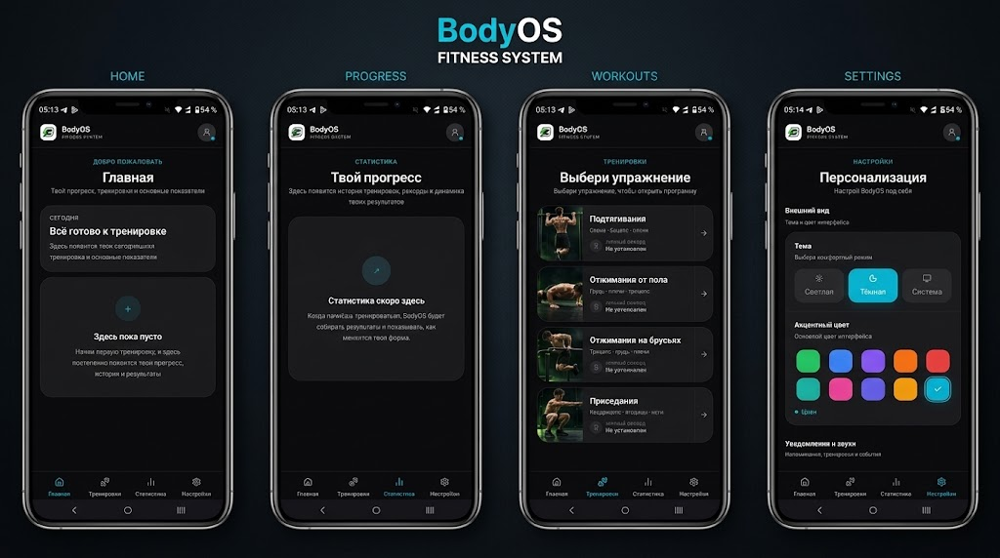
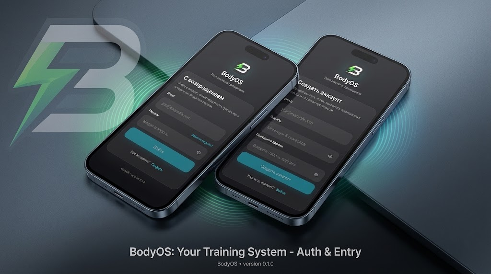

# 🏋️ BodyOS

> Персональная система для планирования, выполнения и отслеживания тренировок с собственным весом.

BodyOS превращает хаотичные занятия в понятную систему: от оценки текущих возможностей и составления индивидуального плана до фиксации подходов и наглядного анализа прогресса.

---

## 📸 Скриншоты

| Основные разделы | Авторизация |
| :---: | :---: |
|  |  |

---

## ✨ Возможности

- **🔐 Авторизация и сессии:** Регистрация, вход, безопасное управление сессиями и восстановление пароля через Email.
- **🏋️ Управление тренировками:** Автоматическое формирование персональных недель, гибкое планирование дней, трекинг каждого подхода с записью повторений (с возможностью отмены или пропуска).
- **📈 Аналитика и прогресс:** Тестирование максимальных повторений, общая история, статистика активности и процент выполнения плана.
- **⚙️ Персонализация:** Светлая/тёмная тема оформления, звуковые таймеры отдыха, настройка часового пояса и уведомлений.

---

## 🛠️ Технологический стек

| Технология       | Назначение                       |
| :--------------- | :------------------------------- |
| **Next.js**      | Fullstack-фреймворк (App Router) |
| **React**        | Пользовательский интерфейс       |
| **TypeScript**   | Строгая типизация                |
| **Tailwind CSS** | Стилизация интерфейса            |
| **PostgreSQL**   | Реляционная база данных          |
| **Prisma**       | ORM для работы с БД              |
| **Resend**       | Сервис транзакционных Email      |
| **Lucide**       | Иконки интерфейса                |

---

## 📊 Цикл тренировки

```text
Определение уровня ──> Формирование плана ──> Выполнение подходов
                                                     │
Анализ прогресса <── Сохранение истории <── Завершение тренировки
```

---

## 📁 Структура проекта

```text
app/
├── (app)/          # Основной интерфейс приложения
├── (auth)/         # Авторизация и восстановление доступа
├── api/            # API endpoints
├── components/     # UI-компоненты
├── emails/         # Шаблоны писем (Resend)
├── lib/            # Утилиты и клиентская логика
├── providers/      # React-провайдеры (темы, контекст)
└── server/         # Серверная логика и бизнес-правила

prisma/
└── schema.prisma   # Схема БД и связи сущностей

public/
├── docs/           # Скриншоты репозитория
├── exercises/      # Изображения упражнений
├── icons/          # Иконки приложения
└── sounds/         # Звуки таймеров и уведомлений
```

---

## 🚀 Быстрый запуск

### 1. Клонирование и установка зависимостей

```bash
git clone https://github.com/TeGaLeX15/workhealth.git
cd workhealth
npm install
```

### 2. Настройка окружения

Создайте файл `.env` в корне проекта:

```env
# PostgreSQL через Supabase connection pooler
DATABASE_URL="postgresql://postgres.<project-ref>:PASSWORD@aws-0-ap-south-1.pooler.supabase.com:6543/postgres?pgbouncer=true"

# Прямое подключение к PostgreSQL для Prisma миграций
DIRECT_URL="postgresql://postgres.<project-ref>:PASSWORD@aws-0-ap-south-1.pooler.supabase.com:5432/postgres"

# Resend
RESEND_API_KEY="re_xxxxxxxxxxxxxxxxx"

# Email отправителя
EMAIL_FROM="onboarding@resend.dev"
```

### 3. Настройка базы данных

```bash
npx prisma generate
npx prisma migrate dev
```

### 4. Запуск в режиме разработки

```bash
npm run dev
```

Приложение будет доступно по адресу `http://localhost:3000`.

---

## 🏗️ Production

Сборка и запуск оптимизированной версии:

```bash
npm run build
npm start
```
